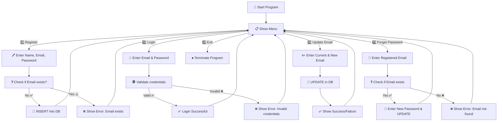

# 🚀 Login & Registration System (Java + MySQL)

[](https://www.java.com/)
[](https://dev.mysql.com/downloads/connector/j/)
[](https://opensource.org/licenses/MIT)

A **console-based** Java application with **MySQL (JDBC)** that enables users to:

- 📝 Register (Name, Email, Password)  
- 🔐 Login with validation  
- ✏️ Update Email address  
- 🔄 Reset Password (Forget Password)  
- ⏹ Exit program  

---

## ✨ Features

| Feature              | Description                                  |
|----------------------|----------------------------------------------|
| 📝 Registration       | Register new users with name, email, password |
| 🔐 Login              | Validate user credentials from MySQL DB      |
| ✏️ Update Email       | Change user email securely                   |
| 🔄 Forget Password    | Reset password if forgotten                  |
| ⏹ Exit               | Close the program gracefully                 |

---

## 🛠 Requirements

- ☕ Java **8 or higher**  
- 🐬 MySQL installed & running  
- 🔗 JDBC Driver → [**Download MySQL Connector/J**](https://dev.mysql.com/downloads/connector/j/)  
- 💻 IDE (IntelliJ / Eclipse / VS Code) **or** terminal  

---

## ⚙️ Database Setup  

Run these queries in **MySQL** before starting the program:

```sql
CREATE DATABASE login_re_db;
USE login_re_db;

CREATE TABLE registered (
    id INT AUTO_INCREMENT PRIMARY KEY,
    name VARCHAR(100) NOT NULL,
    email VARCHAR(100) UNIQUE NOT NULL,
    password VARCHAR(100) NOT NULL
);
```
---

# 📝 Internal Working (Flow)

## Registration Flow
1. User enters **Name**, **Email**, **Password**.  
2. Executes `INSERT` query into the `registered` table.  
3. If email exists → show error message.  

## Login Flow
1. User enters **Email** and **Password**.  
2. Executes `SELECT` query to validate credentials.  
3. If valid → login success, else → show error.  

## Update Email Flow
1. User enters **current email** + **new email**.  
2. Executes `UPDATE` query in DB.  

## Forget Password Flow
1. User enters registered email.  
2. If exists → allows resetting password via `UPDATE` query.  

## Exit
- Program terminates gracefully.  

---
## 🌀 Flowchart


---
## ▶️ How to Run

### 1️⃣ Set MySQL password as environment variable

**Linux / Mac**
```bash
export DB_PASSWORD="your_mysql_password"
```
**Windows PowerShell**
```bash
setx DB_PASSWORD "your_mysql_password"
```

### 2️⃣ Compile & Run
```bash
javac LoginOrReg.java
java LoginOrReg
```
---
## 🖥 Sample Menu

| Option | Action                 | Description                          |
|--------|-----------------------|--------------------------------------|
| 1      | Register              | Register a new user (Name, Email, Password) |
| 2      | Login                 | Login using registered Email and Password |
| 3      | Update Email          | Update your current email address    |
| 4      | Forget Password       | Reset your password if forgotten     |
| 5      | Exit                  | Terminate the program gracefully     |

Enter the Option:            // Take input
---


## 🚀 Future Improvements
- 🔒 Use password hashing (**BCrypt / SHA**) instead of plain text  
- 📧 Add email verification system  
- 🎨 Build a GUI or Web version  
- 🔑 Add session management for logged-in users  

---

## 📜 License
This project is licensed under the **MIT License** – free to use, modify, and distribute.  

---
<p align="center">
💡 Made with ❤️ using <strong>Java + MySQL</strong>
</p>


